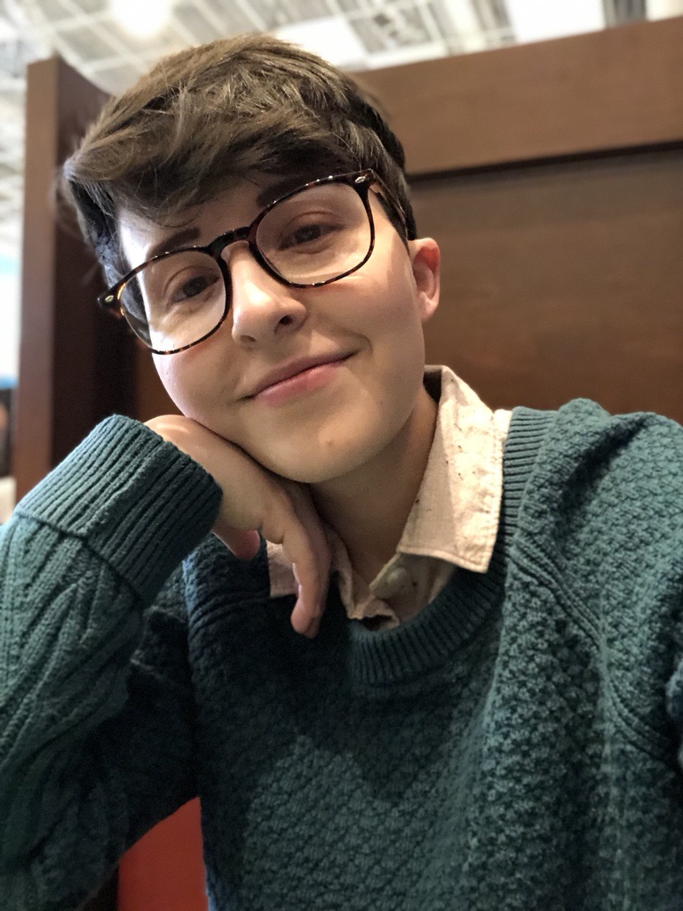

# bosalinas-portfolio

Things to fix

fixed banner: center and opacity
about-me img: smaller and radius of 20px
    
    .about-me img {
    width: 300px;
    height: 250px;
    border-radius: 30%;
}
portfolio-boxes: flex-box aligned vertically

